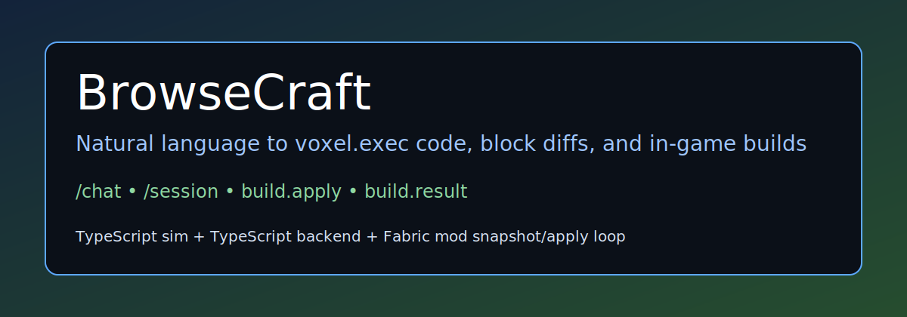
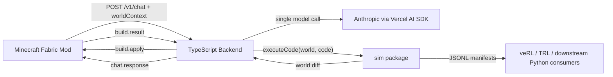

BrowseCraft is a build-only Minecraft assistant built around a single-shot voxel.exec pipeline.
The model writes JavaScript against a small voxel DSL, the server executes that code against a headless world, and the Fabric mod applies the resulting absolute block diff in game.

## Architecture



## Repo Layout

- `sim/`: TypeScript simulator, task generation, grading, collection, curriculum, and export
- `backend/`: TypeScript HTTP/WebSocket server
- `mod/`: Fabric client for snapshot capture, chat UI, and block application

## Quickstart

1. Install workspace dependencies.

   ```bash
   cd ~/BrowseCraft
   pnpm install
   ```

2. Run package tests.

   ```bash
   cd ~/BrowseCraft
   pnpm --filter @browsecraft/sim test
   pnpm --filter @browsecraft/backend test
   cd ~/BrowseCraft/mod && gradle test
   ```

3. Start the backend and the client.

   ```bash
   cd ~/BrowseCraft
   pnpm --filter @browsecraft/backend dev
   ```

   ```bash
   cd ~/BrowseCraft/mod
   gradle runClient
   ```

4. In game, use `/chat <message>` and `/session new|list|switch <id>`.

## Training Data Pipeline

Generate deterministic tasks:

```bash
cd ~/BrowseCraft
pnpm --filter @browsecraft/sim generate-tasks --mode build --seed 45 --count 2 --output sim/runs/build_seed45.jsonl
```

Collect trajectories:

```bash
cd ~/BrowseCraft
pnpm --filter @browsecraft/sim collect --mode build --model claude-sonnet-4-5 --seed 45 --per-tier 2 --output sim/runs/build.jsonl
pnpm --filter @browsecraft/sim collect --mode text_qa --model claude-sonnet-4-5 --seed 45 --per-tier 2 --output sim/runs/text_qa.jsonl
pnpm --filter @browsecraft/sim collect --mode creative --model claude-sonnet-4-5 --seed 45 --count 10 --output sim/runs/creative.jsonl
```

Export stage manifests:

```bash
cd ~/BrowseCraft
pnpm --filter @browsecraft/sim export --input sim/runs/all_episodes.jsonl --output-dir sim/runs/manifests
```

This emits:

- `spatial-sft.jsonl`
- `spatial-grpo.jsonl`
- `creative-sft.jsonl`
- `creative-grpo.jsonl`

`seed=45` is the deterministic validation seed and is locked by the fixtures in `sim/test/fixtures`.
