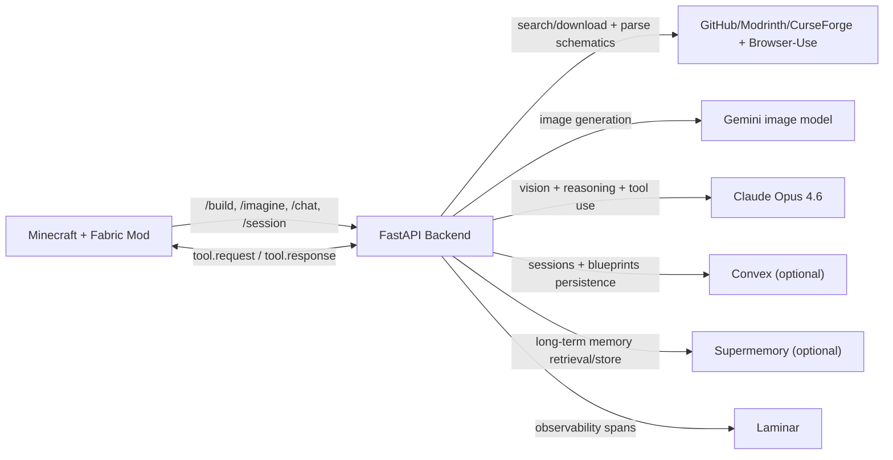

BrowseCraft is a hackathon prototype that lets players search for real schematics, generate new Minecraft structures from text prompts, and iteratively modify builds through an in-game chat agent, all without leaving Minecraft.

## Architecture



## Quickstart

1. Install dependencies and configure environment values.
   ```bash
   cd ~/BrowseCraft/backend
   cp .env.example .env
   # Fill API keys as needed
   uv sync
   ```
2. Run backend and mod tests.
   ```bash
   cd ~/BrowseCraft/backend && uv run pytest -q
   cd ~/BrowseCraft/mod && gradle test
   ```
3. Run the backend, launch Minecraft with the built mod, and test commands in-game.
   ```bash
   cd ~/BrowseCraft/backend && uv run browsecraft-backend
   cd ~/BrowseCraft/mod && gradle build
   ```

## Demo Commands

- `/build <query>`
- `/imagine <prompt>`
- `/chat <message>`
- `/blueprints save|load|list`
- `/materials`
- `/session new|list|switch <id>`
- `/build-test` (fallback demo path)
